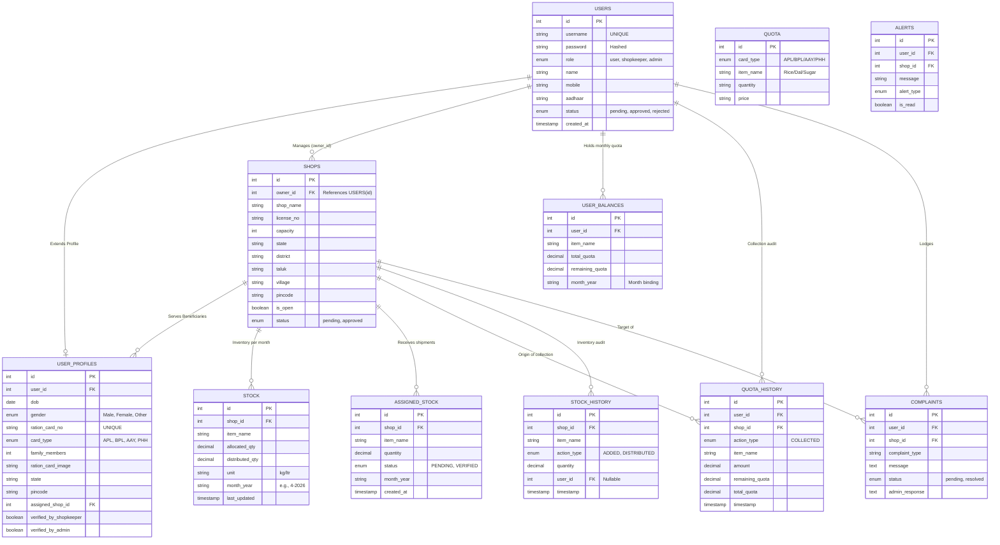
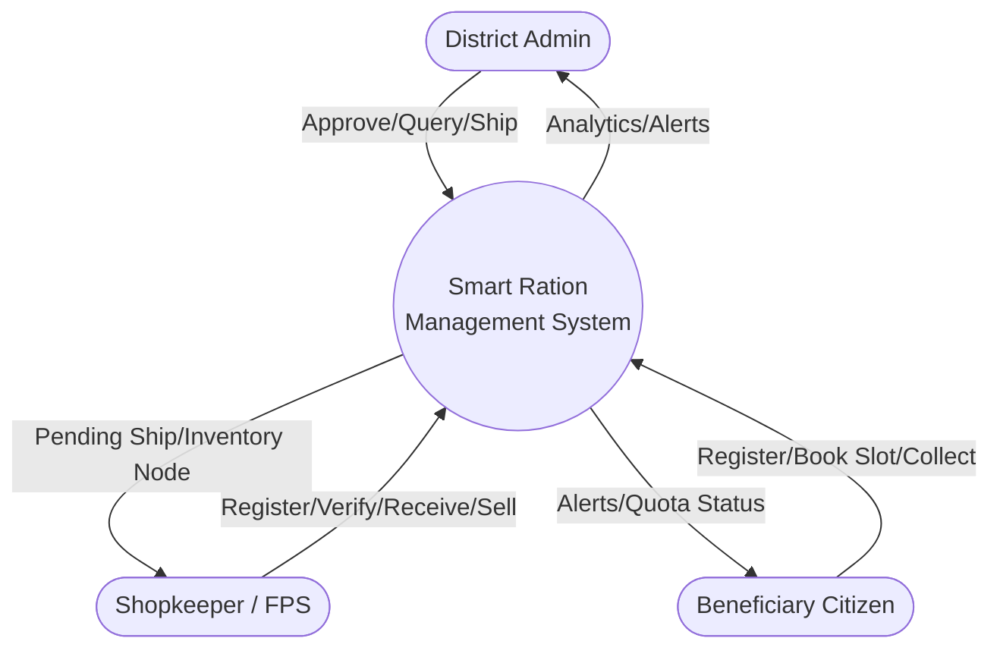
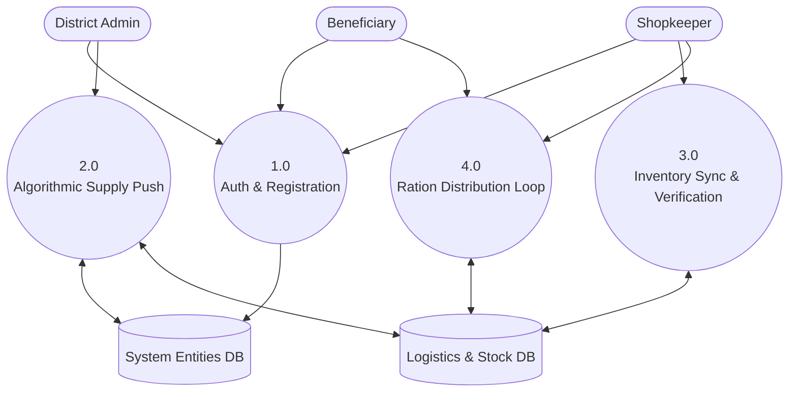
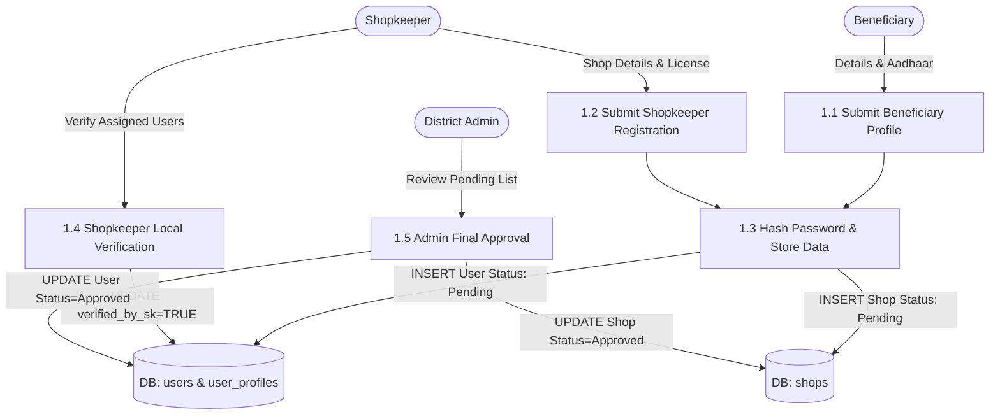
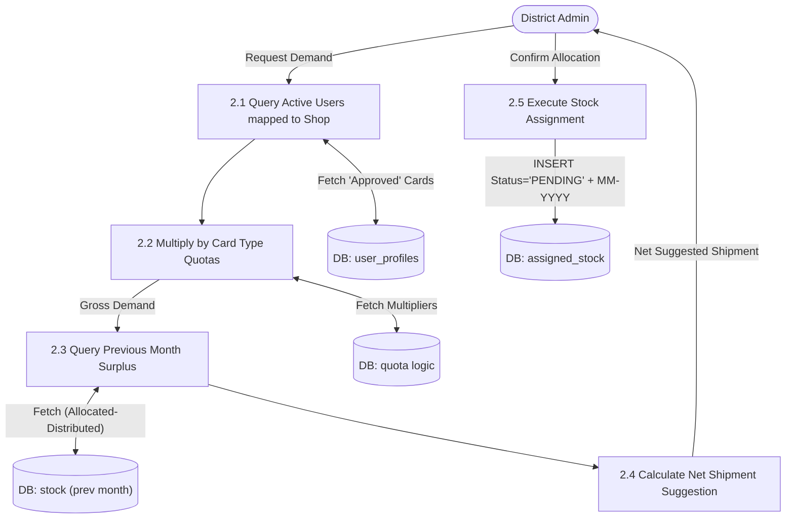
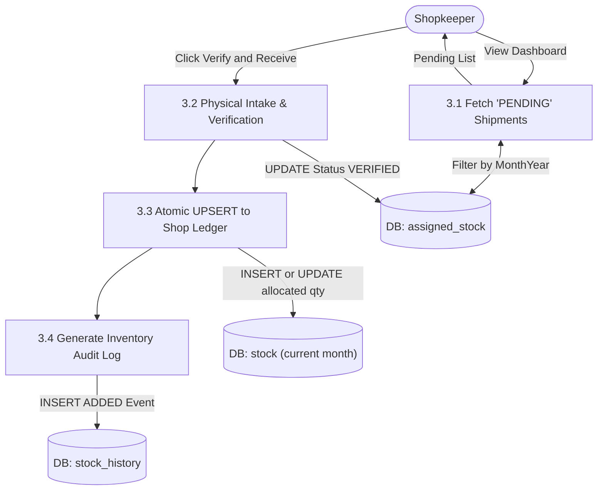
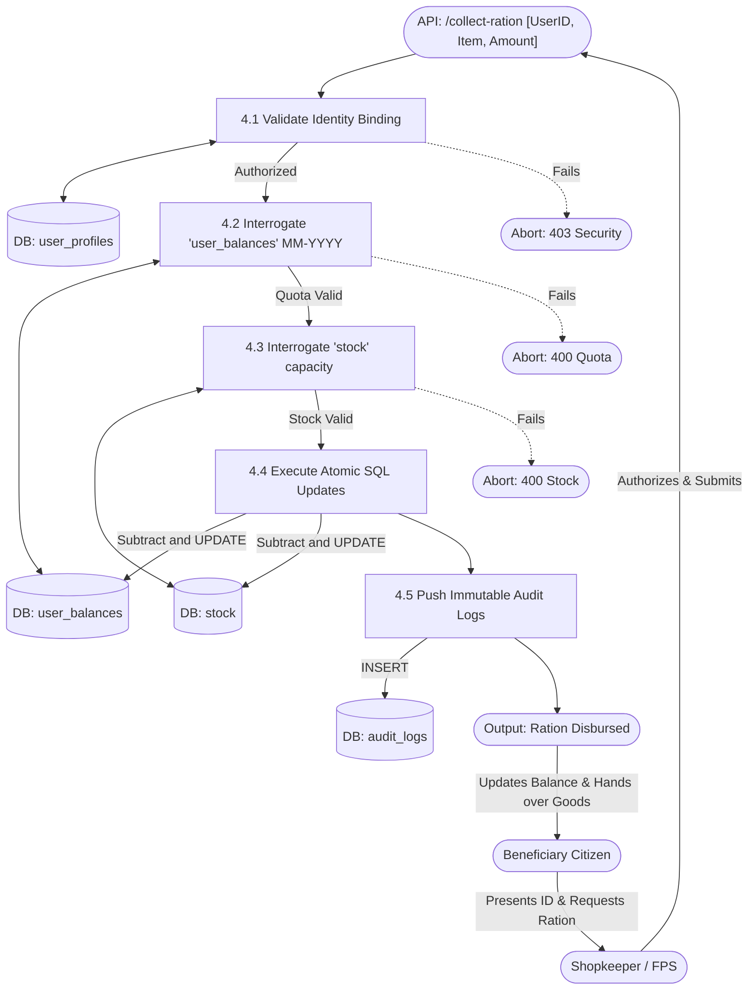

# 🇮🇳 Smart Ration Management System (SRMS)

[](https://reactjs.org/)
[](https://nodejs.org/)
[](https://www.mysql.com/)
[](https://jwt.io/)

A state-of-the-art Digital Public Distribution System (PDS) designed to streamline the distribution of essential commodities. This platform provides transparency, accountability, and convenience for both administrators and citizens.

> 📄 **Documentation Highlight**: The system features an advanced **Demand-Driven Supply Chain** with algorithmic resource allocation, strict `UPSERT` inventory syncing, precise end-of-month expiration limits, and surplus-aware distribution dynamics. Refer to the **Detailed Project Report** for an exhaustive review of the logic, schemas, and security guardrails governing the monthly iteration cycles.

---

## 📽️ Presentation Highlight: Why this Project?

*   **Transparency**: Digital tracking prevents "leakage" of ration commodities.
*   **Convenience**: Citizens avoid long queues via a built-in **Slot Booking System**.
*   **Accountability**: Every collection is logged with date, time, and shop details.
*   **Alert System**: Automated notifications keep users informed about stock and announcements.

---

## 🔑 Demo & Testing Credentials

Use these pre-seeded accounts to experience all roles. **Note: All passwords are provided below.**

| Role | Username | Password | Purpose |
| :--- | :--- | :--- | :--- |
| **Admin** | `admin1` | `admin123` | System oversight & final approvals |
| **Shopkeeper** | `shop1` | `shop123` | Local stock management & user verification |
| **Beneficiary** | `user1` | `user123` | Checking quota & booking slots |

---


## 🏗️ Technical Features
*   **Role-Based Access Control (RBAC)**: Secure routes using JWT tokens stored in LocalStorage.
*   **Dynamic Quota Management**: Admin can change the price or quantity of items per card type globally. The system now fully supports **APL, BPL, AAY, and PHH** card types with pre-configured monthly quotas.
*   **Responsive UI**: Modern dashboard layouts using Vanilla CSS Flexbox and Grid.
*   **Audit Log**: Complete history of every transaction and complaint.

---

## 🚀 Quick Setup Instructions

### 1. Database (MySQL)
1. Ensure MySQL is running (XAMPP/MySQL).
2. Configure `backend/.env` with your DB credentials.
3. Run Setup:
   ```bash
   cd backend
   npm install
   node setup.js
   ```

### 2. Run Applications
*   **Backend**: `cd backend && npm start` (Port 5000)
*   **Frontend**: `cd frontend && npm run dev` (Port 5173/5180)

---

## 📂 Project Structure
*   **/frontend**: React 18 with Vite, Lucide Icons, and modular styling.
*   **/backend**: Express.js server, MySQL connection pool, and JWT auth middleware.
*   **schema.sql**: The complete database design for audits and presentation documentation.

---

## 📋 Requirement Analysis

### 1. Functional Requirements

#### R.1 LOGIN

**R.1.1 User Login**

**I. Login Selection**
* **Description:** Selection of “Login” option.
* **Input:** User selects the Login option.
* **Output:** Prompted to enter Username and Password.

**II. Login Verification**
* **Description:** Verifies the entered Username and Password. If valid, the system checks the user role and approval status.
* **Input:** Username and Password entered.
* **Output:**
  * If Admin, redirects to Admin Dashboard.
  * If Shopkeeper, redirects to Shopkeeper Dashboard after approval verification.
  * If Beneficiary/User, redirects to User Dashboard after approval verification.

**III. Invalid Login Handling**
* **Description:** Displays error message for incorrect credentials or pending approval.
* **Input:** Wrong Username/Password or unapproved account.
* **Output:** Error message such as “Invalid Username or Password” or “Account Pending Approval”.

---

#### R.2 REGISTRATION

**R.2.1 Beneficiary Registration**

**I. Selection of “Register” Option**
* **Description:** Starts beneficiary registration process.
* **Input:** User selects registration option.
* **Output:** Prompted to enter personal and ration details.

**II. Registration**
* **Description:** Registers beneficiary by entering required details.
* **Input:** Name, Aadhaar, mobile, ration card number, card type, address, selected shop, password, username.
* **Output:** Confirmation message “Registration Submitted Successfully”.
* **Process:** Details stored in database with pending approval status.

**R.2.2 Shopkeeper Registration**

**I. Selection of “Register as Shopkeeper” Option**
* **Description:** Starts shopkeeper registration process.
* **Input:** User selects shopkeeper registration.
* **Output:** Prompted to enter owner and shop details.

**II. Registration**
* **Description:** Registers shopkeeper and shop information.
* **Input:** Owner name, mobile, Aadhaar, shop name, license number, location, password, username.
* **Output:** Confirmation message “Shop Registration Submitted”.
* **Process:** Shopkeeper details stored with pending admin approval.

---

#### R.3 BENEFICIARY SERVICES

**R.3.1 View Profile**
* **Description:** Displays beneficiary profile details.
* **Input:** Select Profile option.
* **Output:** Name, ration card type, address, assigned shop details displayed.

**R.3.2 View Monthly Quota** 
* **Description:** Displays allocated monthly ration items.
* **Input:** Select Quota option.
* **Output:** Rice, wheat, sugar, kerosene and quantity displayed based on card type.

**R.3.3 View Distribution History**
* **Description:** Displays ration collection history.
* **Input:** Select History option.
* **Output:** List of previous ration transactions.

**R.3.4 View Alerts/Notifications**
* **Description:** Displays stock arrival and notification alerts.
* **Input:** Select Alerts option.
* **Output:** New stock and announcements displayed.

---

#### R.4 SHOPKEEPER SERVICE

**R.4.1 View Shop Stock**
* **Description:** Displays available stock in ration shop.
* **Input:** Select Stock option.
* **Output:** Item name, allocated quantity, distributed quantity, available balance.

**R.4.2 Update Stock**
* **Description:** Adds new stock to ration shop inventory.
* **Input:** Item selected and quantity entered.
* **Output:** Stock updated successfully.

**R.4.3 Distribute Ration**
* **Description:** Records ration issued to beneficiaries.
* **Input:** Select item and quantity sold.
* **Output:** Distribution recorded and stock updated.

---

#### R.5 ADMIN SERVICE

**R.5.1 Dashboard Management**
* **Description:** Displays overall system statistics.
* **Input:** Open dashboard.
* **Output:** Total users, pending approvals, pending complaints displayed.

**R.5.2 Approve Registrations**
* **Description:** Admin verifies pending beneficiary and shopkeeper accounts.
* **Input:** Select pending request and approve/reject.
* **Output:** Registration status updated.

**R.5.3 Manage Quota**
* **Description:** Admin sets ration quantity and price for card types.
* **Input:** Card type, item name, quantity, price.
* **Output:** Quota updated successfully.

**R.5.4 Add New Item**
* **Description:** Adds new ration item to all card categories and shop stocks.
* **Input:** Item name, quantity, price, unit.
* **Output:** New item added successfully.

**R.5.5 Complaint Management**
* **Description:** Admin reviews and resolves complaints.
* **Input:** Complaint ID and action (resolve/warn/dismiss).
* **Output:** Complaint status updated.

---

#### R.6 COMPLAINT MANAGEMENT

**R.6.1 File Complaint**
* **Description:** Beneficiary can submit complaint against ration shop.
* **Input:** Shop details, complaint description.
* **Output:** Complaint registered successfully.

**R.6.2 Warning Alert**
* **Description:** Sends warning notification to shopkeeper if complaint verified.
* **Input:** Admin selects warning action.
* **Output:** Warning alert sent to shopkeeper.

---

## 📊 System Architecture & Data Flow

### 1. Entity-Relationship (ER) Diagram
Maps the relational dependencies tying identity models (`users`, `shops`) to strictly audited monthly supply ledgers.


### 2. Level 0 DFD (Context Diagram)
Maps the holistic interactions between external actors and the bounds of the System.


### 3. Level 1 DFD (Subsystem Modules)
Breaks the main processes into Registration, Algorithmic Allocation, Inventory Sync, and the Atomic Sale Node.


### 4. Level 2 DFDs (Atomic Processes)
Microscopic views detailing the internal architecture of each isolated subsystem module.

#### 4.1. Process 1.0: Auth & Registration


#### 4.2. Process 2.0: Algorithmic Supply Push


#### 4.3. Process 3.0: Inventory Sync & Verification


#### 4.4. Process 4.0: Ration Distribution Loop


---
**Developed for College Presentation — 2026**
