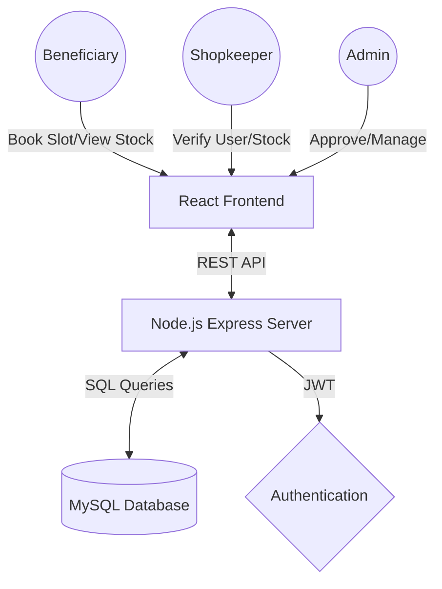

# 🇮🇳 Indian Ration Management System (Smart PDS)

[](https://reactjs.org/)
[](https://nodejs.org/)
[](https://www.mysql.com/)
[](https://jwt.io/)

A comprehensive **Digital Public Distribution System (PDS)** designed to modernize the distribution of essential commodities. This project replaces paper-based records with a transparent, role-based digital workflow.

---

## 📽️ For Presentation: At a Glance

- **The Problem**: Lack of transparency, long queues, and manual verification errors in the current ration system.
- **The Solution**: A three-tier digital platform connecting **Admins**, **Shopkeepers**, and **Beneficiaries**.
- **USP**: Real-time stock alerts, slot booking to reduce queues, and a two-stage verification process.

---

## 🛠️ Key Features by Role

### 🏛️ Admin Dashboard
- **Verification Hub**: Final approval for new shops and user accounts.
- **Quota Control**: Dynamically update ration quantities (Rice, Wheat, etc.) for different card types (BPL, APL, AAY).
- **Grievance Redressal**: Resolve complaints filed by beneficiaries against shops.
- **System Stats**: View total users, pending approvals, and active complaints.

### 🏪 Shopkeeper Dashboard
- **Beneficiary Verification**: Verify new user applications at the local level.
- **Inventory Control**: Update stock arrival and track distributed quantities.
- **Availability Toggle**: Real-time "Shop Open/Closed" status for users.
- **Stock Alerts**: Automatic notifications to beneficiaries when new stock arrives.

### 👤 Beneficiary (User) Dashboard
- **Quota Tracker**: Real-time view of monthly eligibility based on card type.
- **Slot Booking**: Choose a date and time to collect ration, avoiding long queues.
- **Live Stock**: See if the shop currently has items in stock before visiting.
- **Complaints**: File issues regarding quality or behavior directly to the Admin.

---

## 🏗️ Project Architecture



---

## 🚀 Quick Setup

### 1. Database (MySQL)
1. Ensure MySQL is running (XAMPP/Workbench).
2. Create `backend/.env` with:
   ```env
   DB_HOST=localhost
   DB_USER=root
   DB_PASSWORD=yourpassword
   DB_NAME=ration_db
   JWT_SECRET=ration_secret
   ```
3. Run Setup:
   ```bash
   cd backend
   npm install
   node setup.js
   ```

### 2. Run Applications
- **Backend**: `cd backend && npm start` (Runs on port 5000)
- **Frontend**: `cd frontend && npm run dev` (Runs on port 5173/5180)

---

## 🔑 Demo Access
| Role | Username | Password |
| :--- | :--- | :--- |
| **Admin** | `admin1` | `admin123` |
| **Shopkeeper** | `shop1` | `shop123` |
| **Beneficiary** | `user1` | `user123` |

---

### 3. Frontend (React + Vite)
1. Open a new terminal in the `frontend` folder.
2. Run:
   ```bash
   npm install
   npm run dev
   ```
   *The app will run on http://localhost:5173*

---

## 📂 Directory Structure
- `/backend`: Express.js API, JWT auth, and MySQL connection pool.
- `/frontend`: React frontend, Vite build tool, modular CSS, and Lucide Icons.
- `/backend/uploads`: Stores digital copies of ration cards uploaded during registration.

---
**Developed for College Presentation — 2026**
