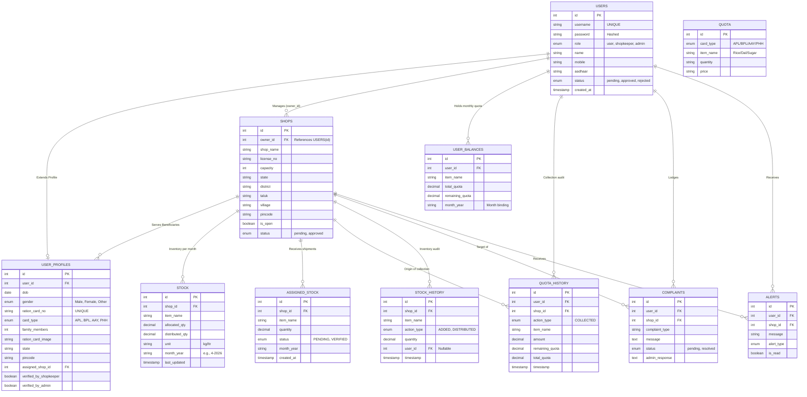
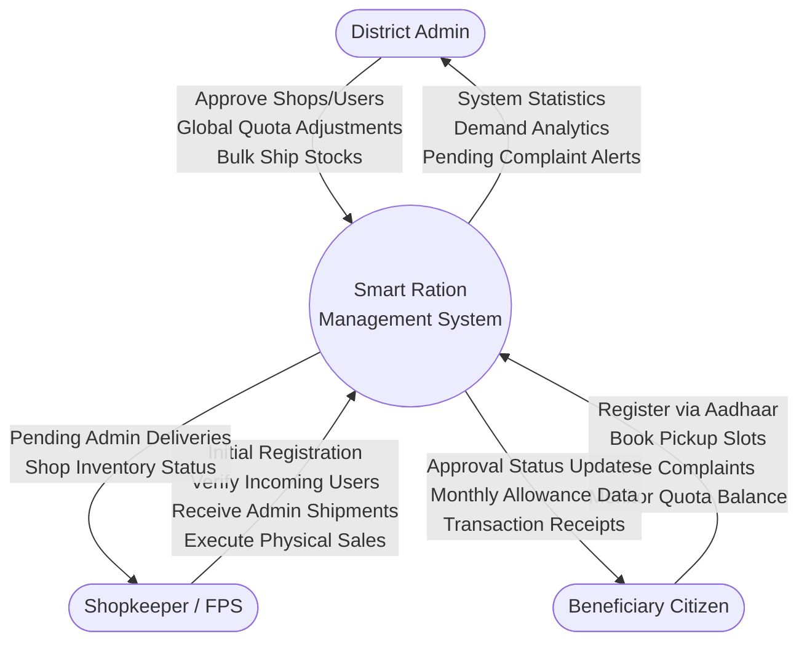
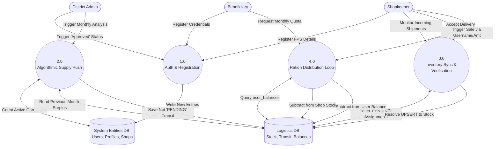
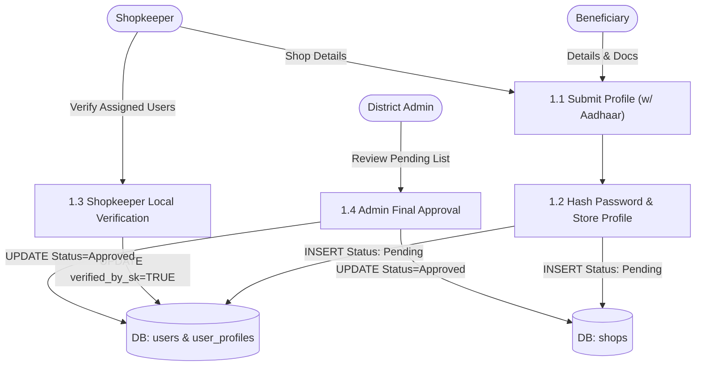
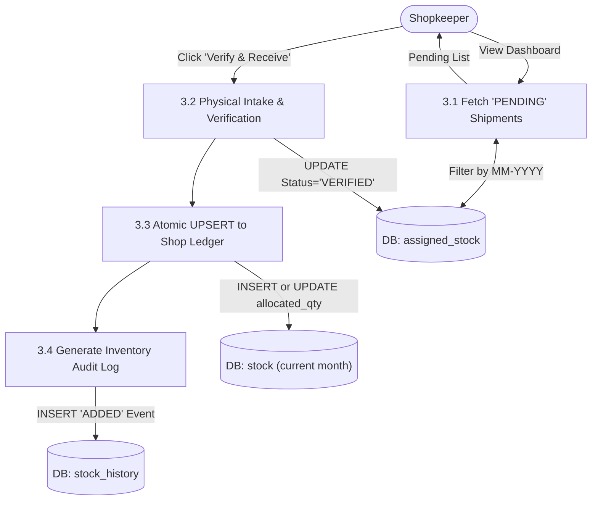

# System & Architectural Diagrams: MyRation

## 1. Full Entity-Relationship (ER) Diagram
This is the complete, holistic mapping of the MySQL database schema. It explicitly details the attributes within every table, including foreign keys (`FK`) mapping logic, enumerations, primary keys (`PK`), and relational constraints.



---

## 2. Data Flow Diagrams (DFD)

The Data Flow Diagrams dissect the application processes into hierarchical levels, moving from a broad system overview down to atomic backend logic.

### 2.1 Level 0 DFD (Context Level)
The Context Diagram defines the macro-environment. It visualizes the entire "Smart Ration Management System" (SRMS) as a single monolithic node and illustrates only the boundaries and interactions with external entities.



### 2.2 Level 1 DFD (Subsystem Processing Level)
Level 1 decomposes the central node heavily into 4 independent operational modules that carry data back and forth to central data pools.



### 2.3 Level 2 DFDs (Atomic Processes)
Microscopic views detailing the internal architecture of each isolated subsystem module.

#### 2.3.1 Process 1.0: Auth & Registration


#### 2.3.2 Process 2.0: Algorithmic Supply Push
```mermaid
flowchart TD
    Admin([District Admin])

    P21["2.1 Query Active Users mapped to Shop"]
    P22["2.2 Multiply by Card Type Quotas"]
    P23["2.3 Query Previous Month Surplus"]
    P24["2.4 Calculate Net Shipment Suggestion"]
    P25["2.5 Execute Stock Assignment"]

    D_Users[("DB: user_profiles")]
    D_Stock[("DB: stock (prev month)")]
    D_Quota[("DB: quota logic")]
    D_Transit[("DB: assigned_stock")]

    Admin -->|Request Demand| P21
    P21 <-->|Fetch 'Approved' Cards| D_Users
    P21 --> P22 <-->|Fetch Multipliers| D_Quota
    P22 -->|Gross Demand| P23
    P23 <-->|Fetch (Allocated-Distributed)| D_Stock
    P23 --> P24
    P24 -->|Net Suggested Shipment| Admin

    Admin -->|Confirm Allocation| P25
    P25 -->|INSERT Status='PENDING' + MM-YYYY| D_Transit
```

#### 2.3.3 Process 3.0: Inventory Sync & Verification


#### 2.3.4 Process 4.0: Ration Distribution Loop
```mermaid
flowchart TD
    Input(["API: /collect-ration [UserID, Item, Amount]"])
    Beneficiary([Beneficiary Citizen])
    Shopkeeper([Shopkeeper / FPS])
    
    Beneficiary -->|Presents ID & Requests Ration| Shopkeeper
    Shopkeeper -->|Authorizes & Submits| Input
    
    P41["4.1 Validate Identity Binding"]
    P42["4.2 Interrogate 'user_balances' MM-YYYY"]
    P43["4.3 Interrogate 'stock' capacity"]
    P44["4.4 Execute Atomic SQL Updates"]
    P45["4.5 Push Immutable Audit Logs"]
    
    D_Users[("DB: user_profiles")]
    D_Bal[("DB: user_balances")]
    D_Stock[("DB: stock")]
    D_Hist[("DB: audit_logs")]

    Input --> P41 <--> D_Users
    P41 -->|Authorized | P42 <--> D_Bal
    P42 -->|Quota Valid| P43 <--> D_Stock
    P43 -->|Stock Valid| P44 -->|UPDATE (-)| D_Bal & D_Stock
    P44 --> P45 -->|INSERT| D_Hist
    P45 --> Output(["Output: Ration Disbursed"])
    
    Output -->|Updates Balance & Hands over Goods| Beneficiary
    
    P41 -.->|Fails| Reject1(["Abort: 403 Security"])
    P42 -.->|Fails| Reject2(["Abort: 400 Quota"])
    P43 -.->|Fails| Reject3(["Abort: 400 Stock"])
```
